# Power Pay with Rapyd
B2B payments are done smart, fast, and in an extra secure way with Microsoft's Power Platform tools

### NOTE: Please check the Judge section for email and password to access the Microsoft office tenant used to build this application and steps to use/test the application

## YouTube Demo Video 📺📺
### [Click here to watch the demo](https://www.youtube.com/watch?v=WWD2JrgJoss&ab_channel=LateNightCodewithSanthosh)


<a href="https://youtu.be/WWD2JrgJoss">
  
</a>

## Setup environment variable
#### Please set the below variables
- RAPYD_ACCESS_KEY - Rapyd sandbox access key
- RAPYD_SECRET_KEY - Rapyd sandbox secret key
- MSFT_CLIENT_ID - Microsoft Azure Active Directory Client ID
- MSFT_CLIENT_SECRET - Microsoft Azure Active Directory Client Secret
- TENANT_ID - Microsoft Account Tenant ID
- RAPYD_URL - Rapyd's sandbox URL
- SITE_ID - SharePoint Site ID you wish to connect to

## Run Tests
#### Note: Set the Rapyd environment variable before running the tests

```
python -m unittest discover
```

## Architecture Diagram


## Checkout Page - Embedded inside Microsoft Teams
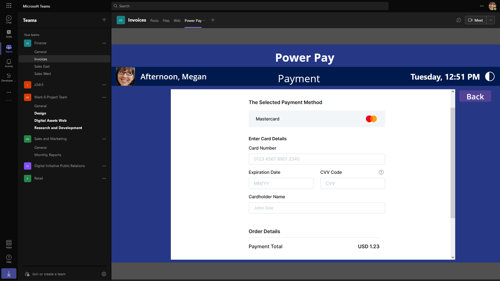

## Dashboard - Dark


## Invoice Generation View - Dark


## Loading Screen
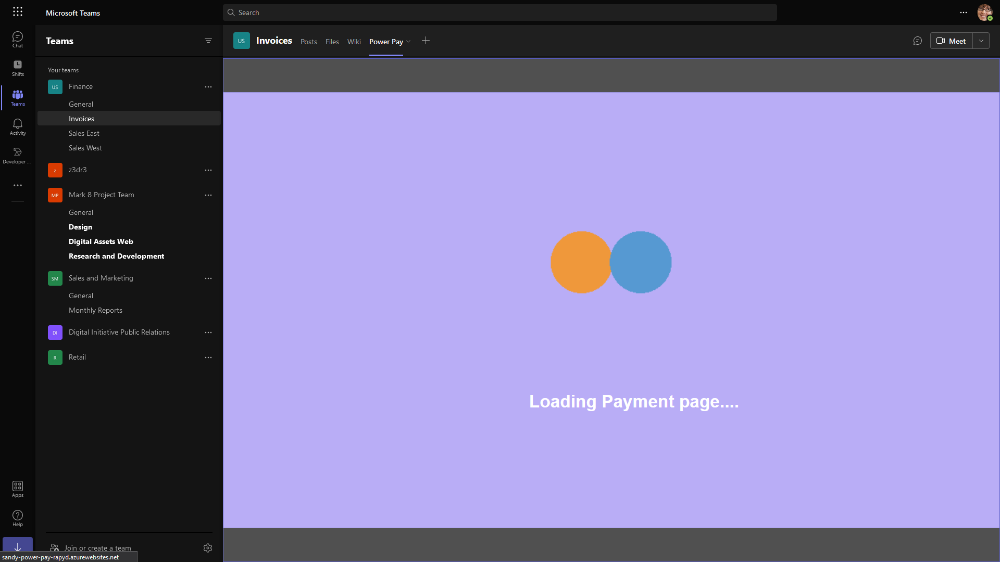

## Teams Approval Flow - Adaptive Card
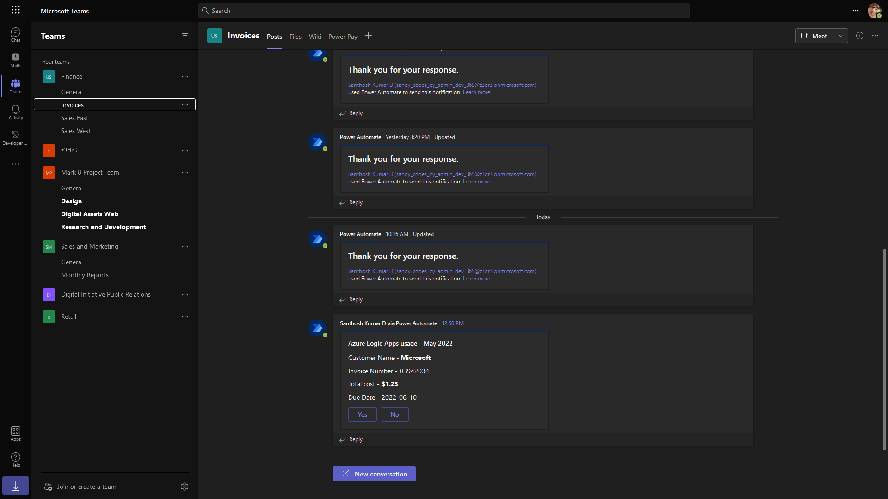
## Invoice View Mode - Dark
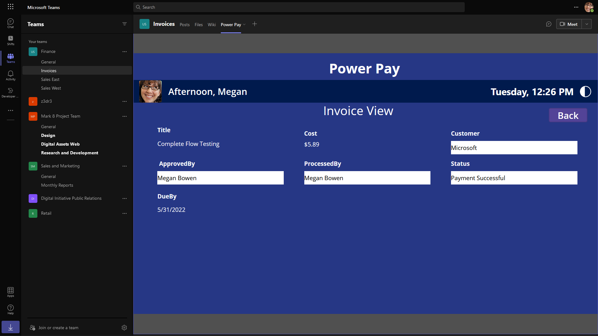
## Invoice Update email trigger
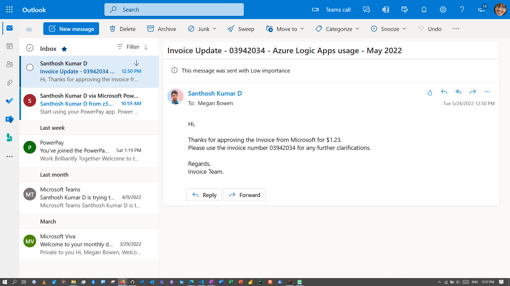

## Invoice List View - Reload - Dark
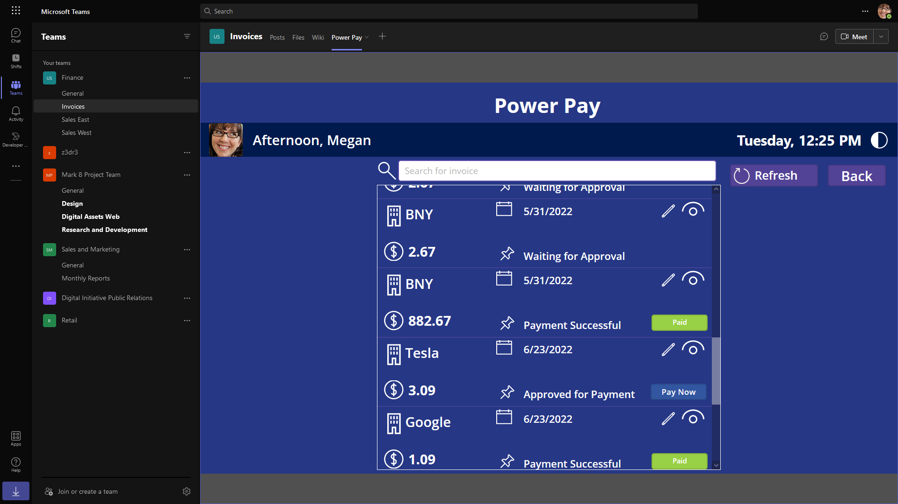

## Checkout Page Filled - Dark
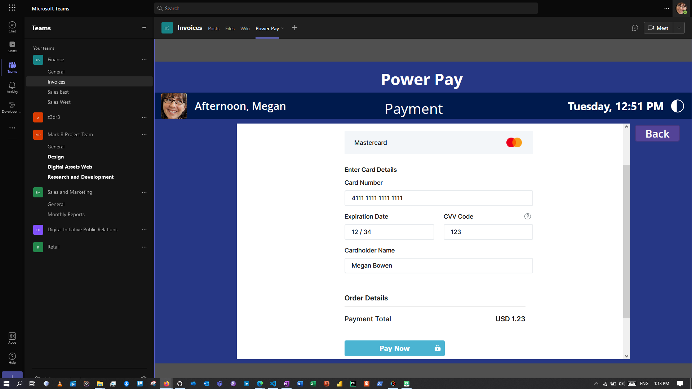

## Checkout Page Success
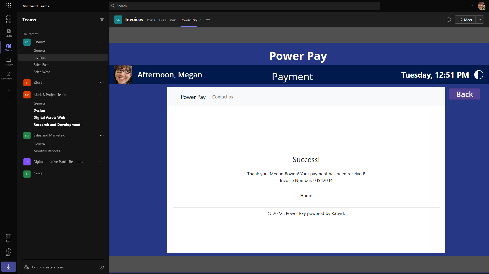

## SharePoint - Invoice List
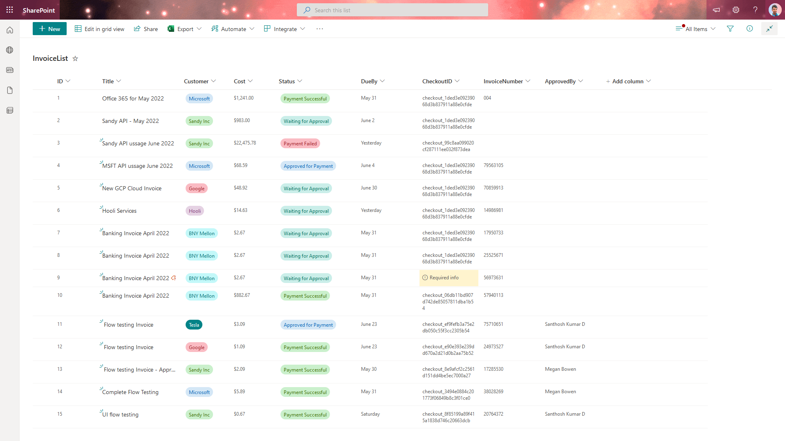
## Invoice Generation Power Automate Flow
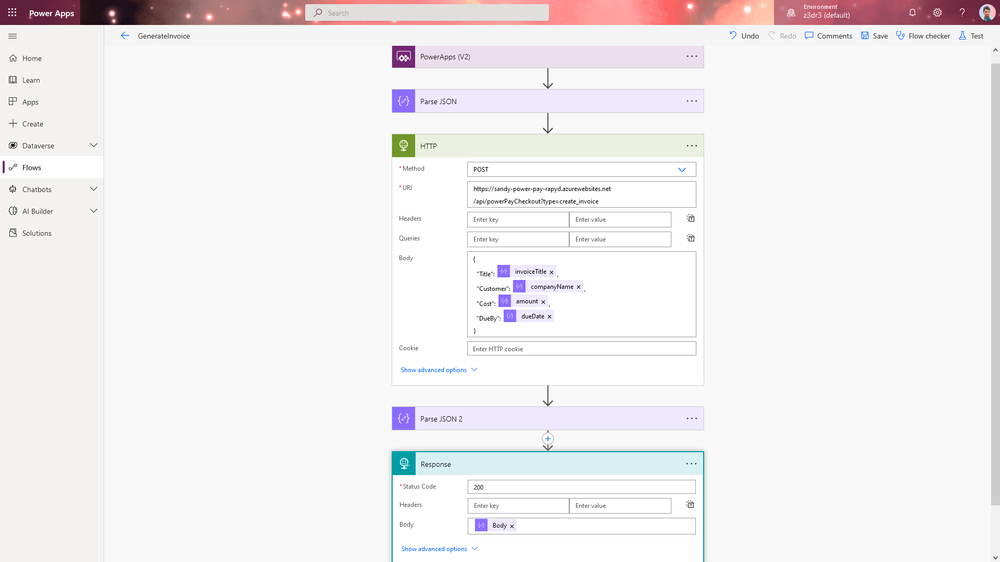
## Invoice Generation Power Automate Flow - Runs
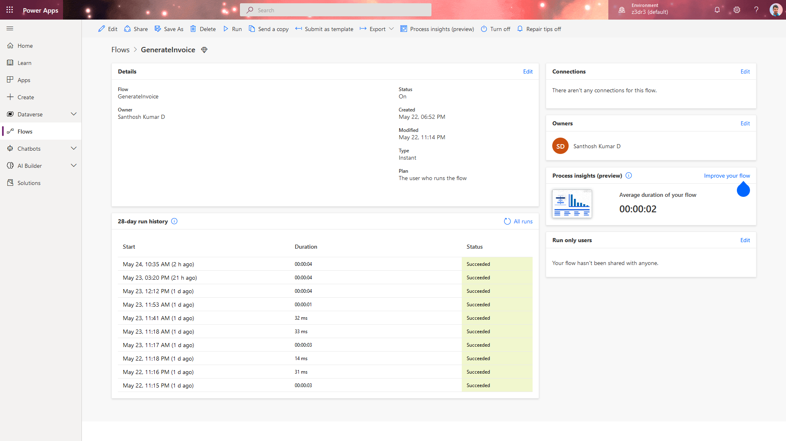

## Invoice Approval Power Automate Flow
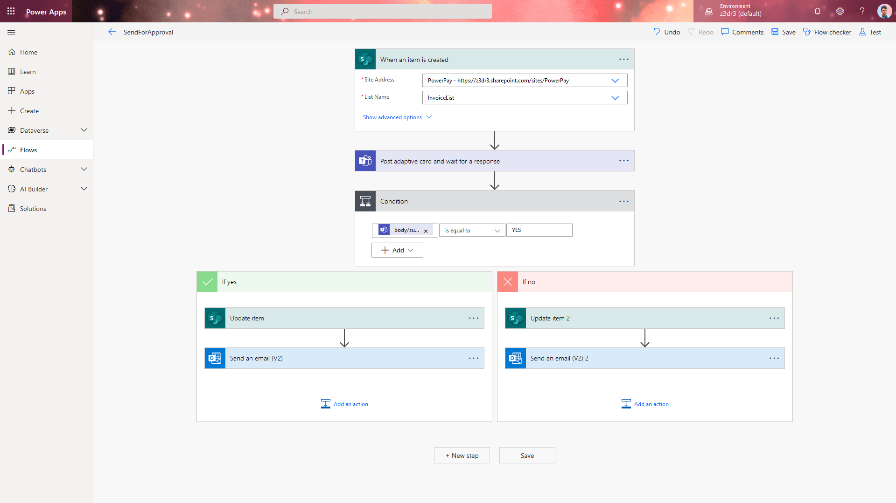

## Invoice Approval Power Automate Flow - Runs
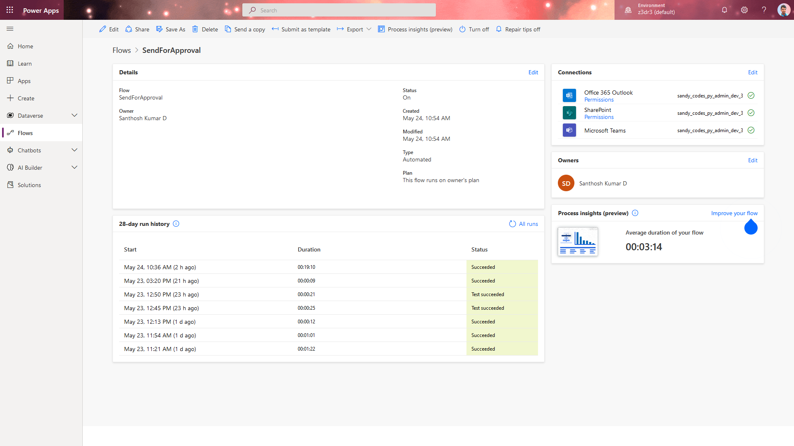
## Invoice Approval Rejected email
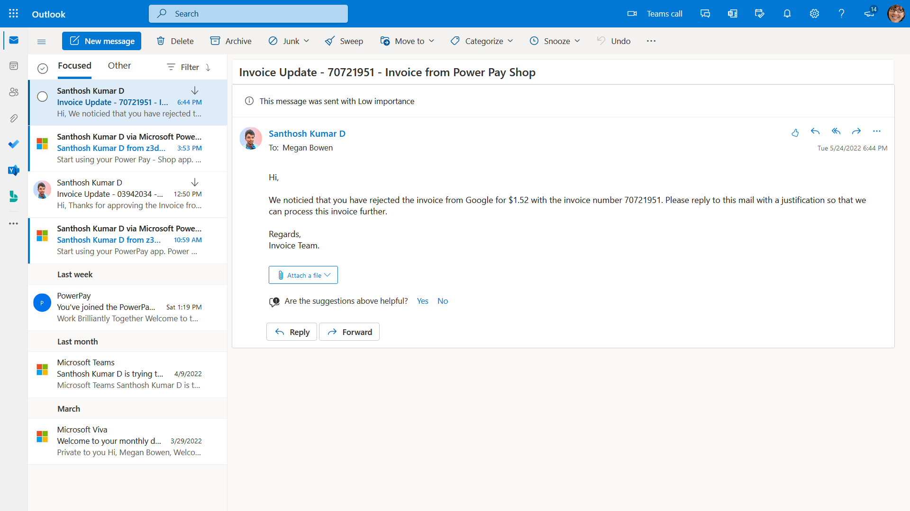
## Invoice View Mode - Light
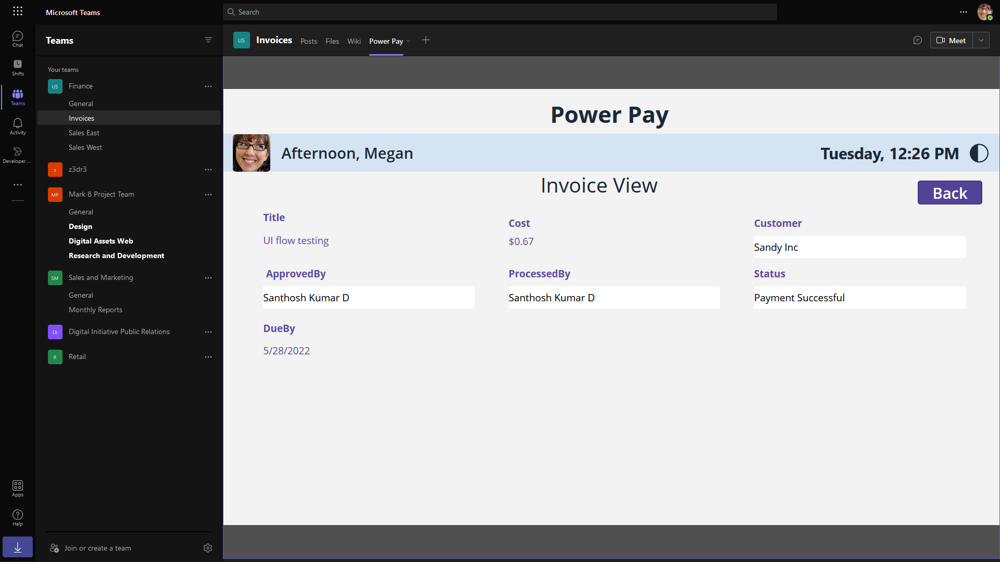

## Invoice Generation View - Light
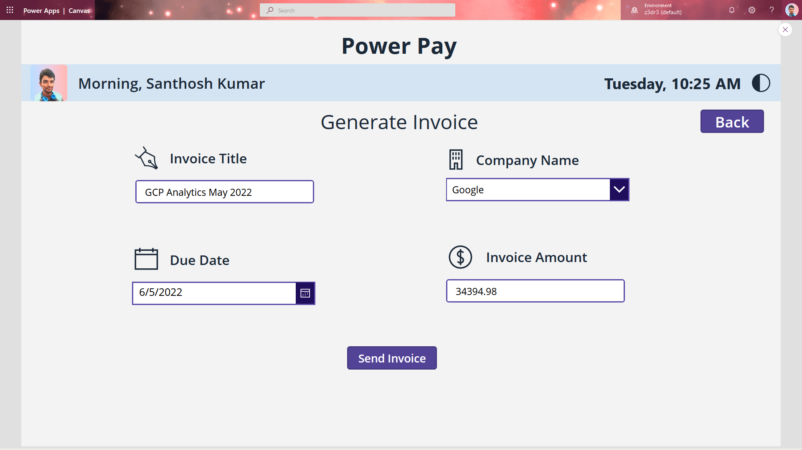

## Invoice List View - Light
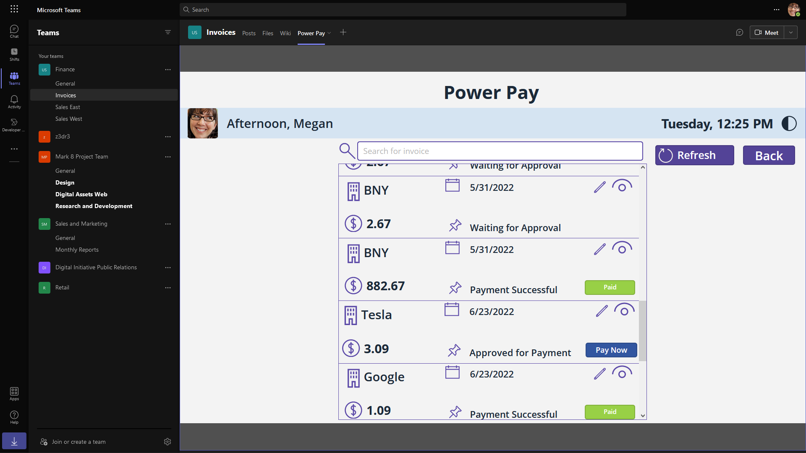
## Dashboard - Light
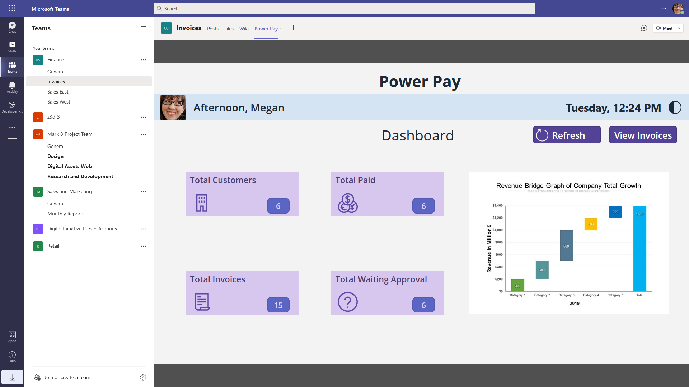
